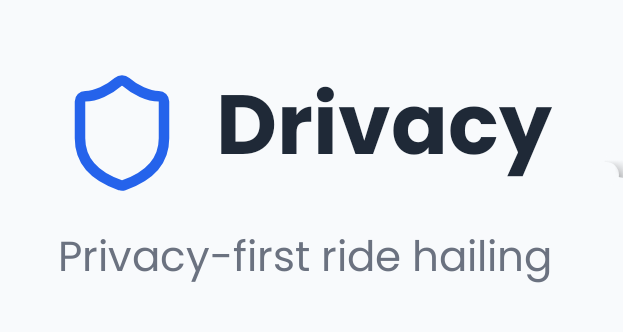

# Drivacy



## Privacy-First Ride Hailing Platform

Drivacy is a modern, privacy-focused ride-hailing mobile application built with React Native and Expo. It offers a seamless experience for booking rides with enhanced privacy controls, emergency safety features, and an intuitive interface.

## 📱 Features

### Core Features
- **Privacy-First Approach**: Your data stays yours - minimal data collection with clear opt-in/out options
- **Intelligent Ride Matching**: Find the best rides with smart algorithms 
- **Real-Time Tracking**: Follow your ride's progress in real-time
- **Multiple Payment Options**: Yet to integegrate....

### Safety Features
- **Driver Authentication**: Verify driver identities with secure methods via email with confirmation link.
- **SOS Emergency Button**: One-tap access to emergency services and contacts
- **Ride Sharing**: Yet to integrate....

### User Experience
- **Intuitive Interface**: Clean, modern design with smooth navigation
- **Personalized Suggestions**: Smart location suggestions based on your history
- **Electric & Eco Friendly Options**: Opt for green transportation alternatives
- **Detailed Fare Estimates**: Know exactly what you'll pay before booking

## 📲 Installation

### Prerequisites
- Node.js (v18 or later)
- Yarn or npm
- Expo CLI
- A Google Maps API key
- A Supabase account for backend services

#### Google Maps API Setup
This app relies on Google Maps API. To obtain your API key:

1. Visit [Google Cloud Console](https://console.cloud.google.com/)
2. Create a new project (or select an existing one)
3. Navigate to API & Services > Credentials
4. Create an API key and enable the following APIs:
   - Maps SDK for Android
   - Maps SDK for iOS
   - Places API
   - Directions API
   - Distance Matrix API
5. Add restrictions to your API key for security

#### Supabase Setup
The backend uses Supabase. To set up:

1. Create an account at [Supabase](https://supabase.com/)
2. Create a new project
3. Get your URL and anon key from the project settings
4. Run the migration scripts from the `supabase/migrations` folder

### Environment Setup
1. Install Expo CLI globally:
   ```bash
   npm install -g expo-cli
   # or use sudo npm install -g expo-cli
   ```

2. Clone the repository:
   ```bash
   git clone -b main https://github.com/yourusername/drivacy.git
   cd drivacy
   ```

3. Install dependencies:
   ```bash
   npm install
   # or with yarn
   # yarn install
   ```
4. Create & Add your API keys in the `.env` file if not already present:
   ```
   EXPO_PUBLIC_GOOGLE_MAPS_API_KEY=your_google_maps_key_here
   EXPO_PUBLIC_SUPABASE_URL=your_supabase_url_here
   EXPO_PUBLIC_SUPABASE_ANON_KEY=your_supabase_anon_key_here
   ```

## 🚀 Running the App

Start the development server:
```bash
npx expo start
# or try with npm
# npm run dev
# or with yarn
# yarn dev
```

This will open Expo Developer Tools in your browser. You can:
- Run on iOS simulator (requires macOS)
- Run on Android emulator
- Scan QR code with Expo Go app on physical device

## 🏗️ Project Structure

```
drivacy/
├── app/                # Main application screens using Expo Router
│   ├── (auth)/         # Authentication screens
│   ├── (tabs)/         # Tab navigation screens
│   └── _layout.tsx     # Root layout with navigation setup
├── assets/             # Static assets like images and fonts
├── components/         # Reusable UI components
├── contexts/           # React contexts for state management
├── hooks/              # Custom React hooks
├── lib/                # Library configurations (Supabase, etc.)
├── supabase/           # Supabase database migrations and types
├── types/              # TypeScript type definitions
├── utils/              # Utility functions
├── app.json            # Expo configuration
└── package.json        # Project dependencies
```

## 🔒 Privacy & Security

Drivacy prioritizes user privacy with:

- Minimal data collection philosophy
- End-to-end encryption for sensitive data
- Option to use the service without permanent data storage
- Local-first data approach where possible
- Regular privacy audits and transparent policies

## ⚙️ Technical Stack

- **Framework**: React Native with Expo
- **Language**: TypeScript
- **Navigation**: Expo Router
- **State Management**: React Context API
- **Backend**: Supabase (PostgreSQL, Authentication, Storage)
- **Maps & Geolocation**: Google Maps API, React Native Maps
- **UI Components**: Custom components with Lucide icons
- **Styling**: React Native StyleSheet

## 🤝 Contributing

Contributions are welcome! Please follow these steps:

1. Fork the repository
2. Create a feature branch: `git checkout -b feature/amazing-feature`
3. Commit your changes: `git commit -m 'Add amazing feature'`
4. Push to the branch: `git push origin feature/amazing-feature`
5. Open a Pull Request

## 📞 Contact & Support

For support or inquiries, please contact us at:
- Email: anubhavbansla12006@gmail.com

---

*Drivacy - Your Ride, Your Privacy*
